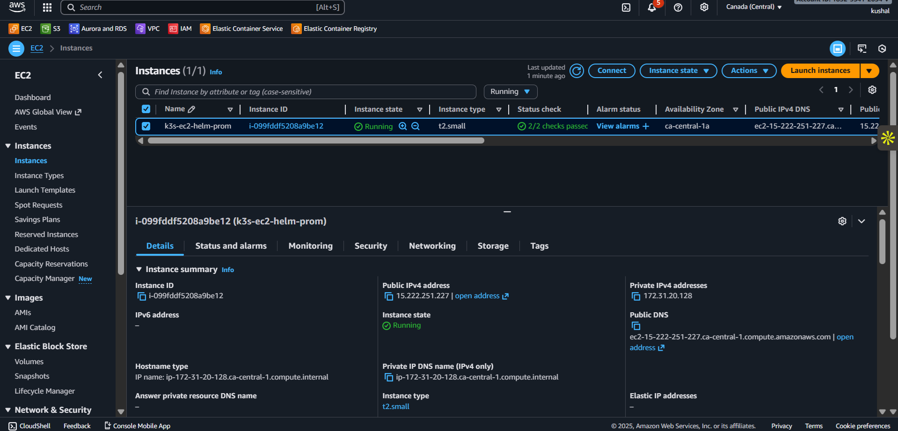
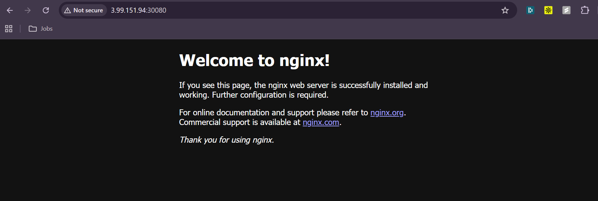
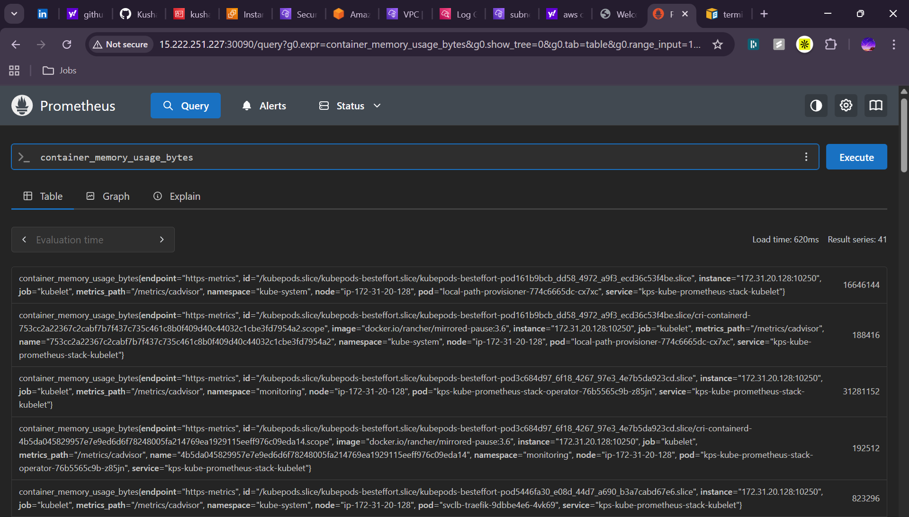

# k3s-ec2-helm-prometheus

This project automates the deployment of a lightweight Kubernetes cluster using **k3s** on an **Ubuntu 22.04 EC2 instance**, followed by installing:

- Nginx (via Helm)
- Prometheus (via Helm)

Everything is driven by a single Bash script (`setup.sh`).

---

## Repository Structure

```bash
k3s-ec2-helm-prometheus/
│
├── setup.sh                      # Main automation script
├── remote_script.sh              # Script to install k3s, helm, prometheus in EC2
├── cleanup.sh                    # (Optional) Removes all AWS resources
├── README.md                     # Documentation
├── .env.example                  # Template for AWS credentials
│
├── Resources/                    # This folder is excluded from version control through .gitignore
│   ├── AWS/
│   │   ├── ec2_details.json      # Stores instance metadata
│   │   └── sg_details.json       # Stores security group metadata
│   │   └── sg_rules.txt          # Stores security group rules metadata
│   │   └── key.pem               # private key to ssh into instance
│   └── Logs/
│       └── setup.log             # Full script log output
```
---

## Prerequisite
Before running this script, make sure the following tools are installed on your machine:
### 1. AWS CLI (Required)
The script uses the AWS CLI to create and manage AWS resources.  
Install it from the official documentation:

[AWS CLI Installation Guide](https://docs.aws.amazon.com/cli/latest/userguide/getting-started-install.html)

Verify installation:

```bash
aws --version
# Example output:
# aws-cli/1.22.34 Python/3.10.12 Linux/6.6.87.2-microsoft-standard-WSL2 botocore/1.23.34
```
### 2. Bash (most Linux systems have it already)
### 3. Optional (recommended)
These will be auto-installed by the script if missing:
- jq
- kubectl
- helm

---

## How to Run
```bash
git clone https://github.com/KushalNishad/k3s-ec2-helm-prometheus.git
cd k3s-ec2-helm-prometheus

cp .env.example .env
vi .env     # add AWS keys + region

chmod +x setup.sh
./setup.sh
```

## Access NGINX web server
http://ec2-instance-public-ip:30080

## Access Prometheus server
http://ec2-instance-public-ip:30090

## To clean up the resources
```bash
./cleanup_script.sh
```

## EC2 Instance Output


## Nginx Webserver Output


## Prometheus Metric Output

